<details>
<summary>Screenshots</summary>

### Berry theme
*This screenshot shows the Berry theme applied in Emacs with a Python file open, demonstrating syntax highlighting and a clean UI.*

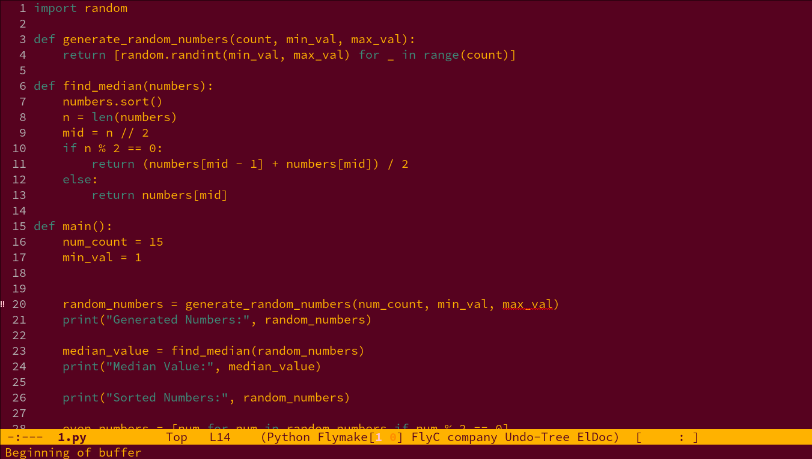  

*This screenshot captures the Berry theme with the minibuffer active.*

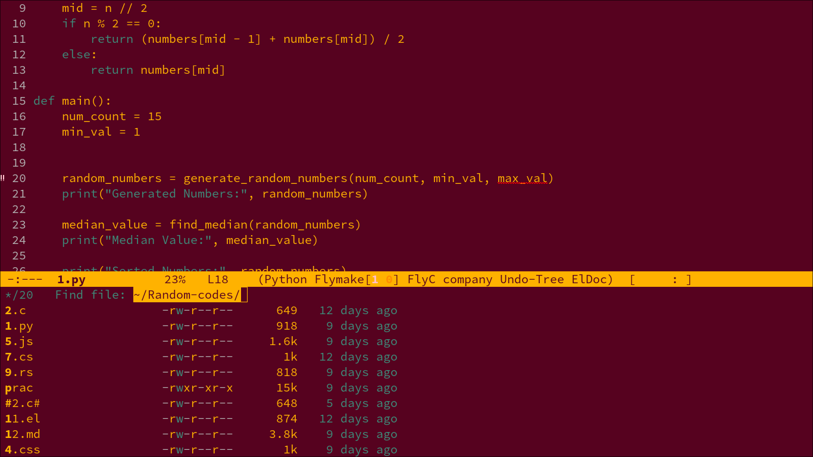  


---

### Roseline Theme
*This screenshot showcases the Roseline theme with both a C file and an HTML file open, illustrating syntax contrast between languages.*

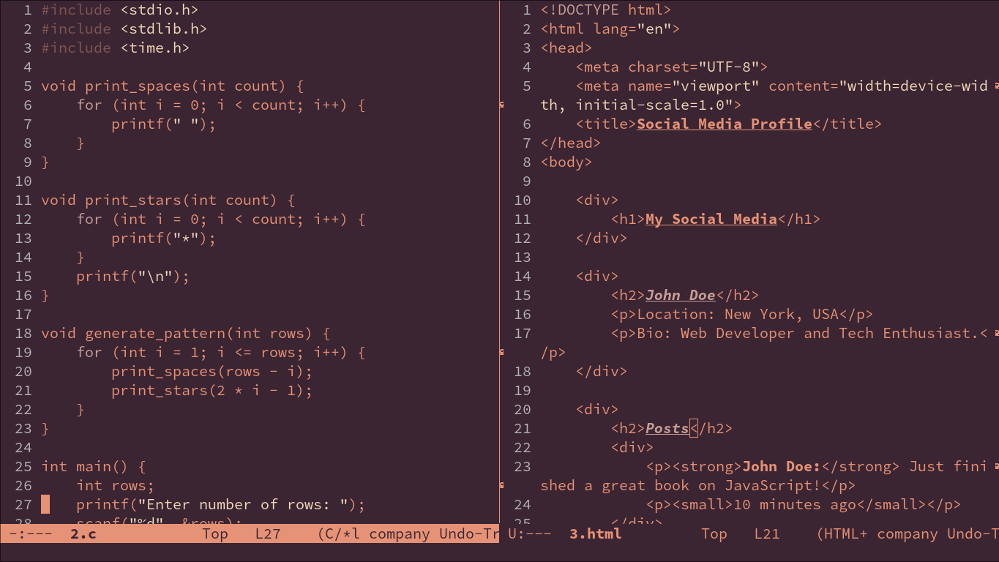

*This screenshot displays the Roseline theme with Treemacs, the minibuffer, and a selection highlight, providing a structured workflow.*

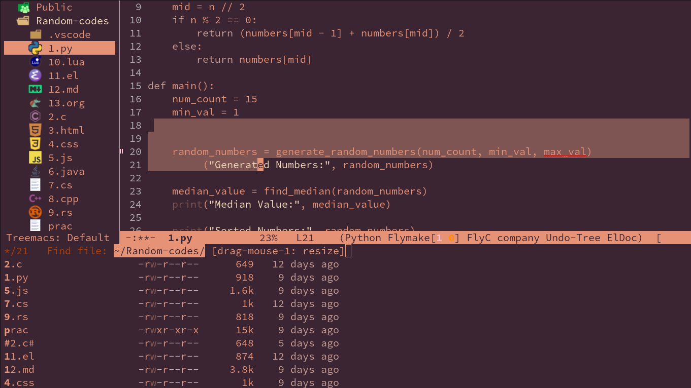  

---

### Ember Twilight Theme
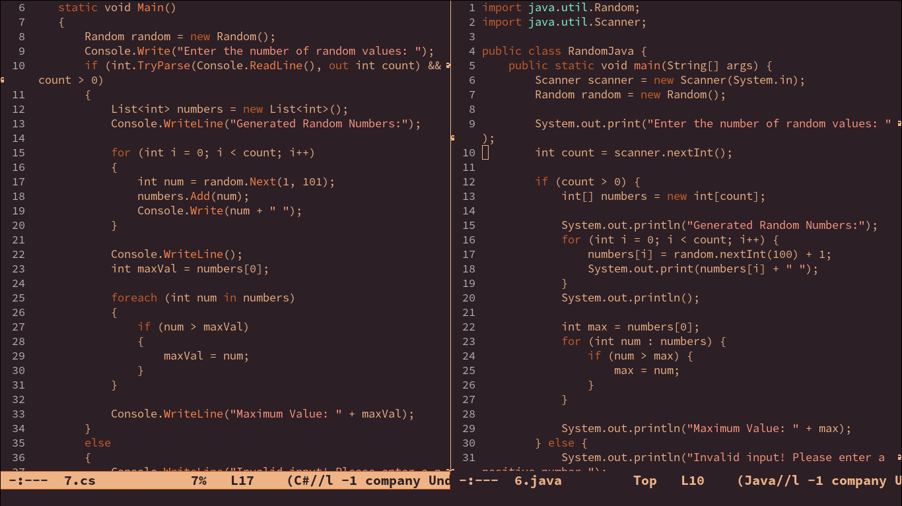  

*This screenshot features the Ember Twilight theme with the minibuffer active and a selection highlighted, demonstrating smooth UI integration.*

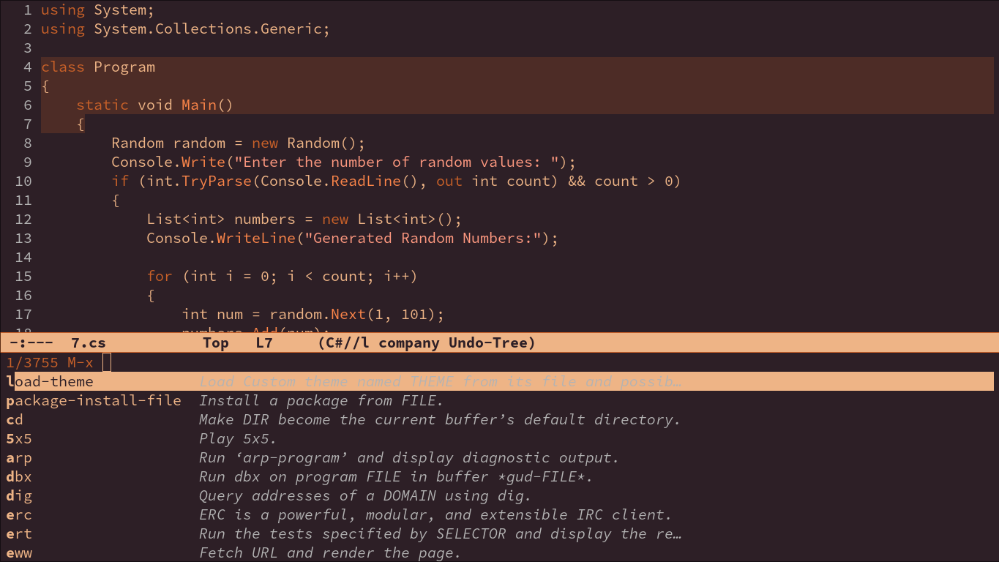  
---

### Marron Gold Theme
*This screenshot shows the Marron Gold theme applied in Emacs with Rust and C++ files open in a horizontal split layout.*

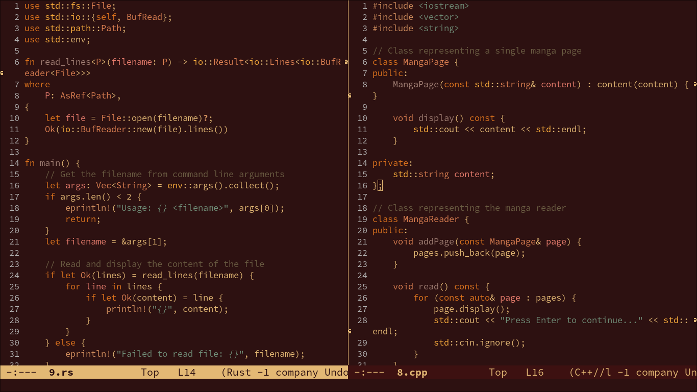  


---

### Amber Glow Theme
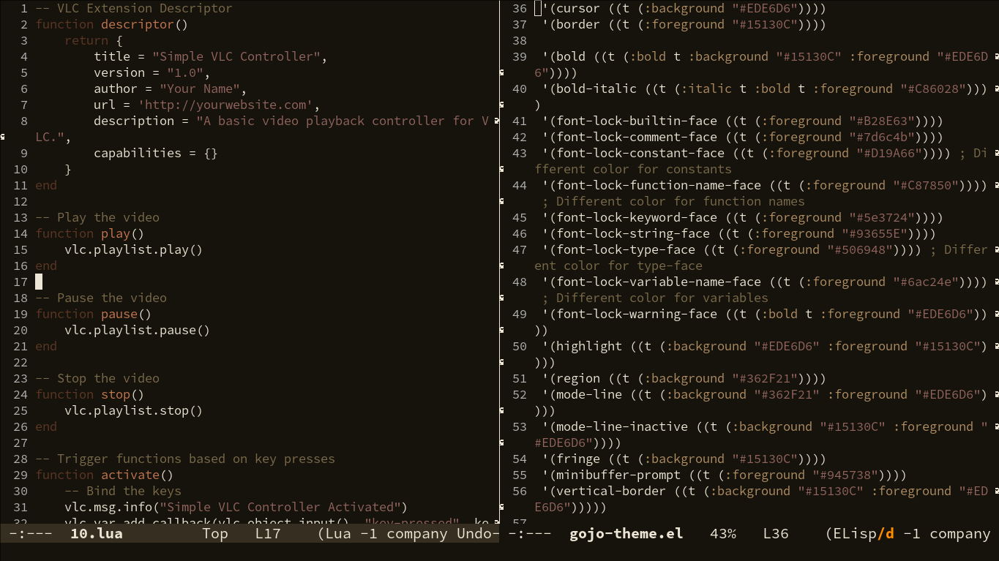  

*A simple screenshot showcasing the Solarized Gruvbox theme with default syntax highlighting.*

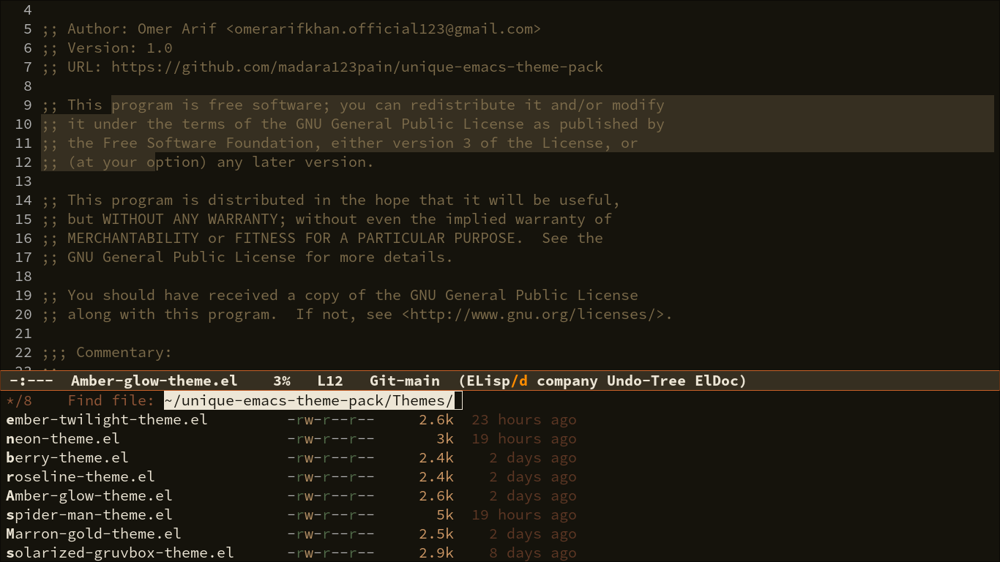  


---

### Solarized Gruvbox Theme
*A simple screenshot showcasing the Solarized Gruvbox theme .*

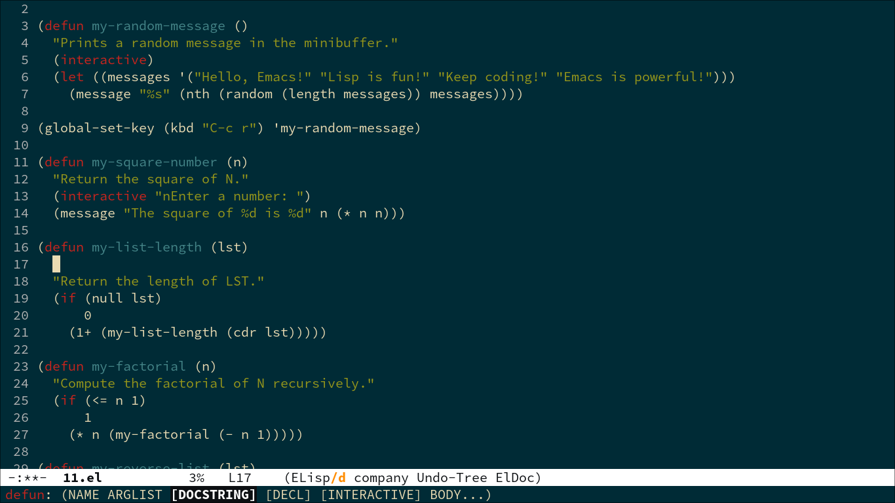  


---

### Spider Man Theme
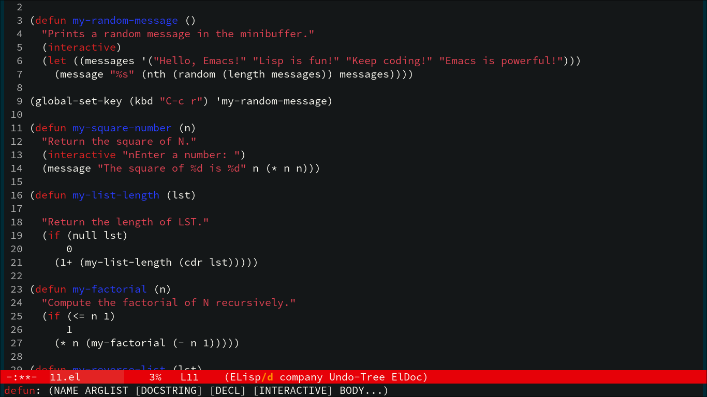  

*A simple screenshot showcasing the Solarized Gruvbox theme with minibuffer.*

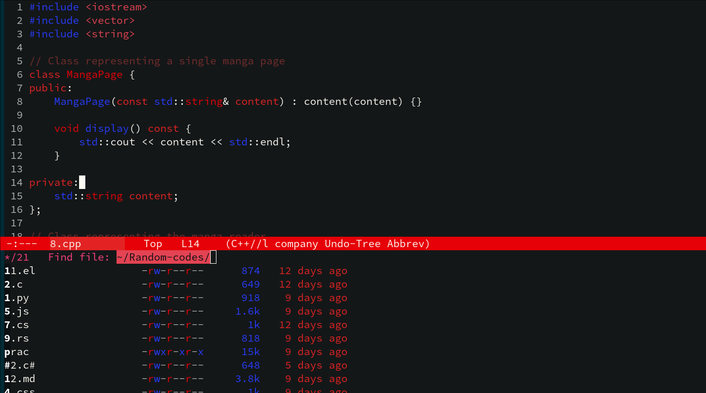  
</details>

## Installation Instructions:

#### Install via MELPA:
Using package.el:

```;; Ensure MELPA is in your package archives
(require 'package)
(add-to-list 'package-archives '("melpa" . "https://melpa.org/packages/"))
(package-initialize)

;; Install the theme (replace THEME-NAME with your preferred theme)
M-x package-install RET THEME-NAME RET

;; Enable the theme
(load-theme 'THEME-NAME t)
```

if you prefer use-package:
```(use-package THEME-NAME
  :ensure t
  :config
  (load-theme 'THEME-NAME t))
```

#### Manual Installation:

Clone the repository:
```
git clone https://github.com/madara123pain/unique-emacs-theme-pack.git
```

Add the Theme Directory to Emacs:
```
(add-to-list 'custom-theme-load-path "~/path/to/unique-emacs-theme-pack/")
(load-theme 'THEME-NAME t)
```